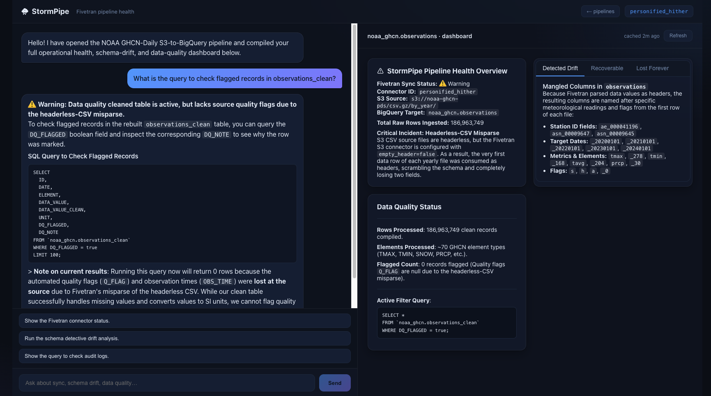

# ⛈ StormPipe

**An agentic pipeline-health operator for Fivetran + BigQuery — it finds the data-quality disasters your sync silently created, reconstructs the clean data with SQL, and proposes the source fix.**

> Google Cloud Rapid Agent Hackathon · Fivetran track

## ▶ Try it now — no install, no deploy

### **[👉 stormpipe-mued7ds4ba-uc.a.run.app](https://stormpipe-mued7ds4ba-uc.a.run.app)**

It's already live on Cloud Run against the **real** 186.9M-row pipeline. Open the link, pick a connector, and watch the agent compose the health dashboard from live BigQuery + Fivetran state — nothing to clone, configure, or run. (Cold start scales from zero, so the first compose takes ~90s; re-opens are near-instant.)



StormPipe ingests NOAA's GHCN-Daily climate archive (**186.9M rows**) through a real Fivetran S3 connector into BigQuery, then puts a multi-agent ADK system in front of it. Ask it about a pipeline and it doesn't just chat — it **composes a live dashboard**: pipeline health, schema drift, and data-quality status, each panel built by a specialist sub-agent and updated in place as you drill in.

---

## Why this is interesting

Most "data pipeline" demos show a green checkmark. Real pipelines fail *silently* — the sync succeeds, rows land, dashboards stay green, and the data is quietly wrong. StormPipe is built around exactly that failure mode, using a **real, reproduced production bug** as its centerpiece.

### The hero bug (real, not staged)

NOAA's GHCN `by_year` CSVs are **headerless**, but the Fivetran connector was configured with `empty_header=false`. So Fivetran ate the **first data row of every file as the column header**. Result: 186.9M rows landed in BigQuery with mangled, per-year-inconsistent column names — observation values masquerading as schema, and the `Q_FLAG` / `OBS_TIME` columns destroyed entirely. Every downstream query is wrong, and nothing alerts.

StormPipe's agents:

1. **Detect** it — `schema_detective` diffs live `INFORMATION_SCHEMA` against the known GHCN schema and recognizes the *header-as-data* misparse signature (not just "a column changed").
2. **Quantify** it — `dq_remediator` runs DQ profiling across the 186.9M rows (76 weather elements, ~638K flagged values).
3. **Repair** it — generates the SQL that rebuilds a corrected `observations_clean` table (COALESCE scattered columns → canonical, tenths → SI units, trace-precipitation tagging).
4. **Fix the source** — `pipeline_controller` proposes the actual Fivetran remediation (`empty_header=true` + historical re-sync) via the Fivetran REST API, gated behind explicit confirmation.

This is the difference between a chatbot *about* a pipeline and an agent that can actually operate one.

---

## Key innovations

| | |
|---|---|
| **Generative dashboard, not chat** | The agent emits [A2UI](https://github.com/google/a2ui) component trees that a custom React renderer turns into live panels. Surfaces carry **stable canonical IDs** (`pipeline-health` / `schema-detail` / `dq-status`), so when you drill into a topic the agent re-emits that surface and the panel **updates in place** instead of spawning a new card. Chat carries the conversation; the canvas carries the state. |
| **Multi-agent specialization** | A root orchestrator routes to three sub-agents — Fivetran control, schema forensics, and DQ remediation — each with its own prompt, tools, and BigQuery/Fivetran scope. |
| **Self-correcting tool layer** | BigQuery tools **return errors as structured data** (`{error, sql, hint}`) instead of raising. When the model hallucinates a column, it *sees* the BadRequest in the tool result and self-corrects (fetch schema → retry) — turning a session-killing 500 into a recoverable in-loop event. |
| **Grounded in domain memory** | Vertex AI **Memory Bank** preloaded with 18 GHCN domain facts (element codes, units, quality flags) so the agent reasons about climate data correctly rather than guessing. |
| **Genuinely generic** | Not hard-wired to one connector — `/pipelines` lists the live Fivetran connectors and you pick one; all tools take an optional `connector_id`. |
| **Fast re-entry** | A cold dashboard compose runs 3 sub-agents + multiple BQ scans (~90s). Results cache in `localStorage` (10-min TTL) → **~85× faster** on re-open while Cloud Run scales to zero between requests. |

---

## Architecture

```
              ┌──────────────────────────────────┐
              │              BROWSER             │
              │    React SPA + A2UI renderer     │
              │   chat (left) · canvas (right)   │
              └────────────────┬─────────────────┘
                  /run, sessions, /pipelines  (HTTP)
                  ▲  A2UI component trees  │
                  │                        ▼
              ┌──────────────────────────────────┐
              │            CLOUD RUN             │
              │  FastAPI — serves SPA + ADK API  │
              │  single origin · scales to zero  │
              └────────────────┬─────────────────┘
                               │
              ┌──────────────────────────────────┐
              │        Orchestrator agent        │
              │     Gemini 3.5 Flash (global)    │
              └──┬─────────────┬──────────────┬──┘
                 │             │              │
                 ▼             ▼              ▼
           pipeline_       schema_          dq_
           controller      detective        remediator
                 │             │              │
                 ▼             ▼              ▼
           Fivetran        BigQuery       BigQuery +
           REST API        INFO_SCHEMA    Memory Bank
           (fix +          (drift /       (DQ rebuild,
            resync)         misparse)      GHCN facts)
                 │             │              │
                 └─────────────┼──────────────┘
                               ▼
              ┌──────────────────────────────────┐
              │   BigQuery dataset  noaa_ghcn    │
              │   observations    186.9M rows    │
              │     └─ header misparse (the bug) │
              │   observations_clean  (rebuilt)  │
              └──────────────────────────────────┘
```

**Stack:** Google ADK 2.1 · Gemini 3.5 Flash (Vertex `global` endpoint) · Fivetran · BigQuery · Vertex AI Memory Bank · A2UI · React 18 + Vite + TypeScript · Cloud Run.

### Layout

```
app/
├── agent.py                 # root orchestrator + sub-agent wiring
├── a2ui_setup.py            # A2UI schema / system-prompt injection, canonical surfaceIds
├── fast_api_app.py          # Cloud Run entrypoint: ADK app + /pipelines, /feedback, SPA mount
├── sub_agents/
│   ├── pipeline_controller.py   # Fivetran control (status, diagnose, fix, resync)
│   ├── schema_detective.py      # INFORMATION_SCHEMA drift + misparse detection
│   └── dq_remediator.py         # DQ profiling + observations_clean rebuild SQL
├── tools/
│   ├── fivetran_tool.py         # Fivetran REST (creds via Secret Manager); mutations gated
│   ├── bigquery_tool.py         # query/schema/DML — returns errors as data
│   ├── schema_comparator.py     # known GHCN schema, misparse fingerprinting, unit maps
│   └── notifier.py
└── prompts/                 # orchestrator + per-sub-agent markdown prompts
frontend/
├── src/
│   ├── Workspace.tsx        # 1:1 split: chat (left) + dashboard canvas (right)
│   ├── PipelineList.tsx     # connector picker
│   ├── a2ui/                # custom A2UI renderer (Card/Tabs/Row/Column/List/…)
│   ├── adk.ts               # ADK REST client
│   └── cache.ts             # localStorage dashboard cache
└── (Vite build → frontend/dist, served by FastAPI)
```

---

## Getting started

### Prerequisites
- [`uv`](https://docs.astral.sh/uv/getting-started/installation/) — Python deps
- Node 18+ — frontend
- [Google Cloud SDK](https://cloud.google.com/sdk/docs/install) — auth + deploy
- `google-agents-cli` — `uv tool install google-agents-cli`
- A GCP project with BigQuery + Vertex AI enabled, and (optional) Fivetran API key/secret

### Install
```bash
uvx google-agents-cli install          # Python deps into .venv
cd frontend && npm install && cd ..
```

### Run locally
The frontend talks to ADK's `/run` + session REST **and** custom `/pipelines` routes — both are served only by `app.fast_api_app` (not `adk api_server`), so run uvicorn directly:

```bash
# Terminal 1 — agent + API (serves the same app Cloud Run runs)
A2UI_ENABLED=1 \
GOOGLE_CLOUD_PROJECT=<your-project> \
GOOGLE_CLOUD_LOCATION=global \
ALLOW_ORIGINS=* \
FIVETRAN_API_KEY=x FIVETRAN_API_SECRET=x \
  .venv/bin/uvicorn app.fast_api_app:app --port 8042

# Terminal 2 — frontend dev server (Vite, proxies API calls)
cd frontend && ADK_URL=http://127.0.0.1:8042 npm run dev
```

Open the Vite URL, pick a pipeline, and the agent composes the health dashboard. (With dummy Fivetran creds, pipeline-control actions are stubbed; schema-drift and DQ run live against BigQuery via ADC.)

> `GOOGLE_CLOUD_LOCATION=global` is **required** — Gemini 3.5 Flash is served only on the Vertex global endpoint and 404s regionally.

### Test & lint
```bash
.venv/bin/adk eval app tests/eval/evalsets/basic.evalset.json \
  --config_file_path tests/eval/eval_config.json   # 6/6 scenario eval
uv run pytest tests/unit                            # unit tests
agents-cli lint
```

### Deploy (Cloud Run)
```bash
cd frontend && npm run build && cd ..               # build SPA into frontend/dist (shipped in the image)
uvx google-agents-cli deploy \
  --project <your-project> --region us-central1 \
  --service-account <agent-sa>@<project>.iam.gserviceaccount.com \
  --update-env-vars "A2UI_ENABLED=1,AGENT_ENGINE_ID=<memory-engine-id>,ALLOW_ORIGINS=*,GOOGLE_CLOUD_LOCATION=global" \
  --no-confirm-project
```

One Cloud Run service serves both the SPA and the agent API from the same origin (no CORS), and scales to zero when idle.

---

## License

Apache-2.0.
